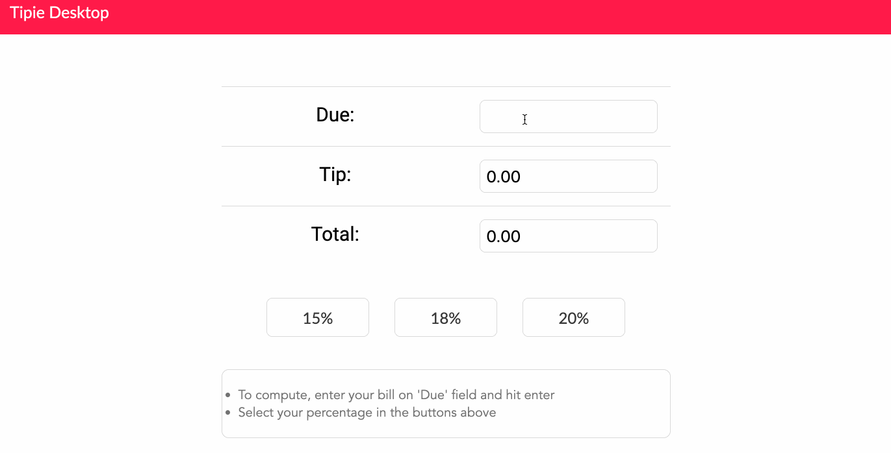

# EmberJS Tip Calculator

Author: Neftali Samarey

A Simple tip calculator app implemented using EmberJS and HTML/CSS. Minimalistic UI based off my iOS App (Tipie) currently available free for download in the apple app store. 

## Time spent

 * About a week here and there.

## User stories

### Required
 * [x] User can enter total bill amount
 * [x] User can choose between at least three tip tiers (e.g. 15%, 18%, 20%) and see the total tip 
 * [x] User can see the total with tip

### Extra

 * Modern UI Design
 

## GIF Walkthrough

GIF created with [LiceCap](https://www.cockos.com/licecap/).

## Notes & shoutouts

Working on mimicking the entire app to mimick my app out in the appstore called "Tipie" which was written entirely in Swift. Feel free to download Tipie for free!
{:width="20%"}